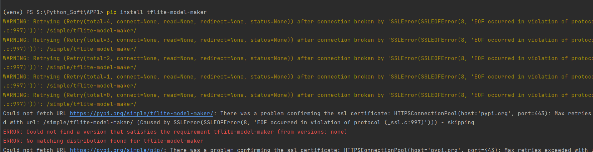

## 安装tensorflow

失败:

[解决博客](https://blog.csdn.net/weixin_42001089/article/details/84403842?ops_request_misc=%257B%2522request%255Fid%2522%253A%2522165477209616782390562798%2522%252C%2522scm%2522%253A%252220140713.130102334..%2522%257D&request_id=165477209616782390562798&biz_id=0&utm_medium=distribute.pc_search_result.none-task-blog-2~all~baidu_landing_v2~default-1-84403842-null-null.142^v11^control,157^v13^new_3&utm_term=+Could+not+find+a+version+that+satisfies+the+requirement+tflite-model-maker&spm=1018.2226.3001.4187)

## 模拟训练代码

```
import os
import numpy as np
import matplotlib.pyplot as plt
import tensorflow as tf

assert tf.__version__.startswith('2')

from tflite_model_maker import model_spec
from tflite_model_maker import image_classifier
from tflite_model_maker.config import ExportFormat
from tflite_model_maker.config import QuantizationConfig
from tflite_model_maker.image_classifier import DataLoader


image_path = tf.keras.utils.get_file(
    'flower_photos.tgz',
    'https://storage.googleapis.com/download.tensorflow.org/example_images/flower_photos.tgz',
    extract=True)
image_path = os.path.join(os.path.dirname(image_path), 'flower_photos')

data = DataLoader.from_folder(image_path)
train_data, test_data = data.split(0.9)

inception_v3_spec = image_classifier.ModelSpec(
    uri='https://storage.googleapis.com/tfhub-modules/tensorflow/efficientnet/lite0/feature-vector/2.tar.gz')
inception_v3_spec.input_image_shape = [240, 240]
model = image_classifier.create(train_data, model_spec=inception_v3_spec)

loss, accuracy = model.evaluate(test_data)

model.export(export_dir='.')
```

## 将生成的文件在实验3程序中运行

郁金香:

